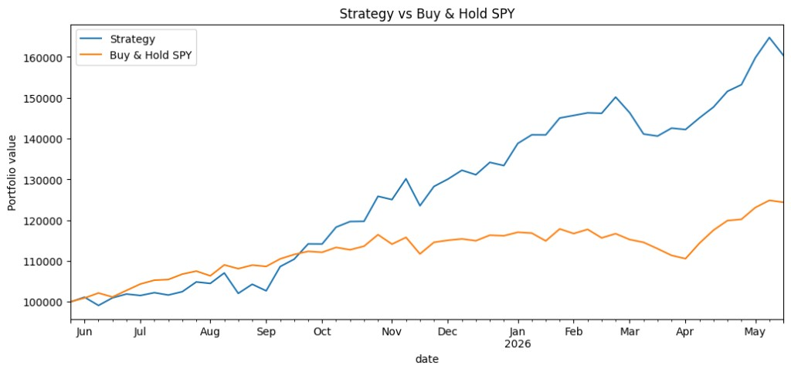
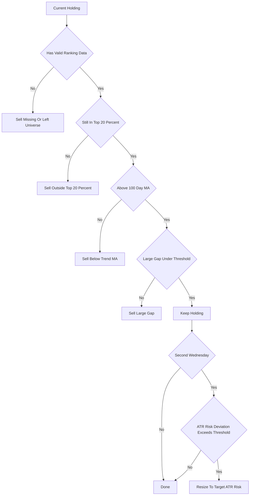

# Clenow Momentum Notebooks

Jupyter notebooks for a weekly S&P 500 momentum workflow inspired by Andreas F. Clenow's
`Stocks on the Move`.

The project downloads S&P 500 data, ranks stocks with a Clenow-style adjusted slope score,
and creates ATR-based buy targets for a portfolio.

## Setup

```bash
python -m virtualenv .venv
source .venv/bin/activate
python -m pip install -e .
python -m ipykernel install --user --name clenow --display-name "Python (clenow)"
jupyter lab
```

## Weekly Workflow

Run the notebooks in order:

1. `notebooks/01_download_sp500_data.ipynb`
  - Fetches current S&P 500 constituents from Wikipedia.
  - Downloads daily OHLCV history from Yahoo Finance via `yfinance`.
  - Saves cached data to `data/processed/sp500_prices.parquet`.
2. `notebooks/02_rank_momentum.ipynb`
  - Computes the adjusted momentum score:

```text
momentum_score = annualized_exponential_regression_slope * r_squared
```

- Uses adjusted close prices for the regression.
- Computes ATR20 from daily OHLC prices.
- Applies configurable price, liquidity, positive-slope, and trend filters.
- Saves rankings to `data/processed/momentum_rankings.parquet` and `.csv`.

3. `notebooks/03_portfolio_targets.ipynb`
  - Edit `ACCOUNT_VALUE`, `AVAILABLE_CASH`, and optional `EXISTING_POSITIONS`.
  - Calculates target shares with:

```text
shares = account_value * daily_move_target / atr_20
```

- Walks down the ranked list and adds buys while enough cash remains.
- Saves `data/processed/buy_list.csv` and `data/processed/buy_list_diagnostics.csv`.

4. `notebooks/04_backtest_weekly_strategy.ipynb`
  - Backtests the weekly strategy over a configurable number of weeks.
  - Uses signals through the prior trading day and executes trades at the configured weekday
    open, defaulting to Wednesday.
  - Prints progress for each rebalance cycle when `SHOW_PROGRESS = True`.
  - Compares the strategy equity curve with buy-and-hold `INDEX_PROXY`.
  - Shows performance ratios including total return, CAGR, volatility, Sharpe, drawdown, and
    Calmar.
  - Saves `backtest_equity_curve.csv`, `backtest_trades.csv`, `backtest_holdings.csv`, and
    `backtest_rebalance_log.csv`.

## Latest Backtest Snapshot

These results come from the cached notebook outputs in `data/processed/`, covering 52 weekly
rebalance dates from 2025-05-28 to 2026-05-20. This run used the current S&P 500 universe,
so the survivor-bias caveat below applies.

| Series | Final Value | Total Return | CAGR | Annual Volatility | Sharpe | Max Drawdown | Calmar |
| --- | ---: | ---: | ---: | ---: | ---: | ---: | ---: |
| Strategy | $160,368.90 | 60.45% | 62.21% | 16.74% | 2.98 | -6.36% | 9.78 |
| Buy & Hold SPY | $124,367.78 | 24.37% | 25.00% | 10.34% | 2.20 | -6.19% | 4.04 |

The run produced 436 trades and ended with 44 open positions.




## Weekly Rebalance Rules



## Key Parameters

Ranking defaults live in `notebooks/02_rank_momentum.ipynb` via `RankingConfig`:

- `lookback_days=90`
- `atr_window=20`
- `trend_ma_window=100`
- `min_price=5.0`
- `min_avg_dollar_volume=10_000_000.0`
- `require_positive_slope=True`
- `require_above_trend_ma=True`

Portfolio sizing defaults live in `notebooks/03_portfolio_targets.ipynb`:

- `DAILY_MOVE_TARGET = 0.001`, which means a one-ATR daily move is targeted at 10 basis
points of account value.
- `ALLOW_PARTIAL_FINAL_POSITION = False`, so the notebook skips candidates when it cannot
afford the full suggested share count.

Backtest defaults live in `notebooks/04_backtest_weekly_strategy.ipynb` via `BacktestConfig`:

- `trade_weekday=2`, where Monday is 0 and Wednesday is 2.
- `index_proxy="SPY"`, with positive trend defined as the prior close above its 100-day
  moving average.
- `top_fraction=0.20`, used for the top-20% hold/buy rule.
- `gap_threshold=0.15`, using open-to-close candle gaps over the ranking lookback window.
- `slippage_bps=5.0`, applied to buys and sells.
- `risk_rebalance_every_n_trades=2`, so risk resizing runs every second Wednesday.
- `risk_rebalance_threshold=0.20`, so minor ATR-dollar risk deviations are ignored.

## Backtest Assumptions

The first backtest version uses the current S&P 500 member list for the whole historical
test. That makes it useful for workflow testing and rough strategy exploration, but it has
survivor bias. A stricter historical test would need point-in-time index constituents.

Signals are built without same-day lookahead: for a Wednesday rebalance, rankings and sell
rules use data through Tuesday close, then trades execute at Wednesday open. If Wednesday is
not a trading day in the cached data, that week is skipped.

## Notes

This is research tooling, not financial advice. Yahoo Finance data can be revised, delayed,
or unavailable for some tickers, so inspect the diagnostics before trading.